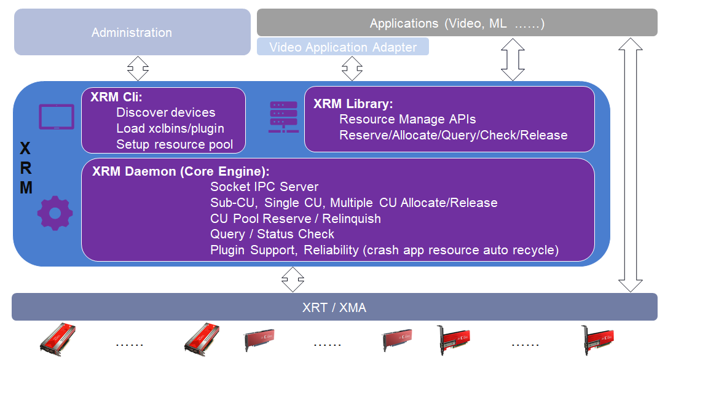

=====================================
Xilinx FPGA Resource Management (XRM)
=====================================

-------------------------------------------------------------------------------

XRM - Xilinx FPGA Resource management is the software to manage all the FPGA hardware
on the system. All the Kernels (IP Kernel or Soft Kernel) on FPGA board are abstracted
as one CU resource in XRM. XRM providers interface to allocate and release CU. The
smallest allocation unit is channel, which is percentage of one CU. XRM providers
command line tool (xrmadm) to download xclbin to device. During the download processing,
XRM builds up the resource database. XRM daemon (xrmd) is running at background as
core engine to support resource reservation, relinquish, allocation and release. The
user APIs are defined in
`xrm.h <src/lib/xrm.h>`_ header file.

-------------------------------------------------------------------------------

`Prerequisites <docs/Prerequisites.rst>`_

-------------------------------------------------------------------------------

`Build Instructions <docs/Build.rst>`_

-------------------------------------------------------------------------------

`Test Instructions <docs/Test.rst>`_

-------------------------------------------------------------------------------

Contact: xrm_dev@Xilinx.com

-------------------------------------------------------------------------------
