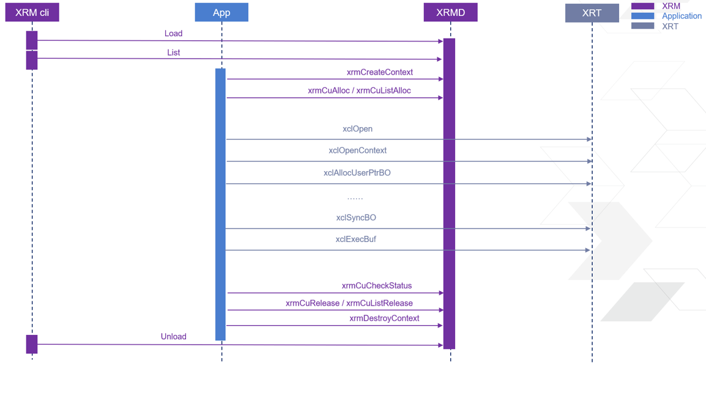
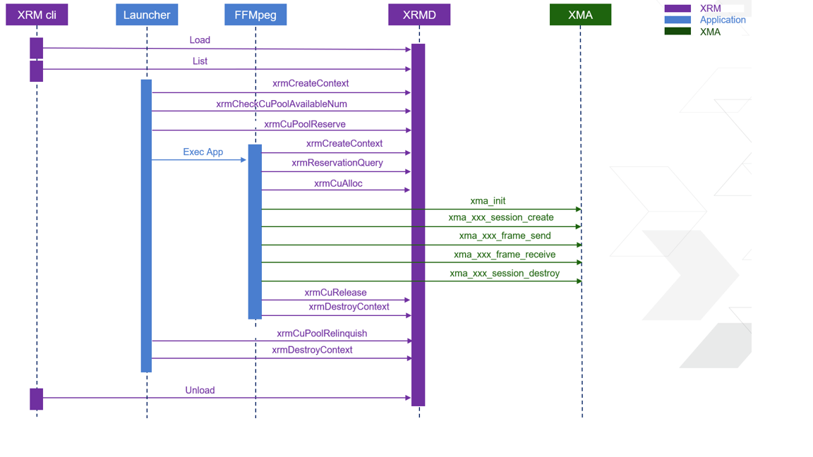

..
   Copyright (C) 2023, Advanced Micro Devices, Inc. All rights reserved.

XRM Application Work Flow
-------------------------

This session will describe the work flow of XRM applications. First one is generic application work flow. The second one is typical video application work flow.

Generic Application Work Flow
~~~~~~~~~~~~~~~~~~~~~~~~~~~~~

Video Application Work Flow
~~~~~~~~~~~~~~~~~~~~~~~~~~~

For the above video application work flow, it should make sure the Adapter keeping alive during the App running. Otherwise the cu resource allocated by Adapter will be released when the Adapter exit (with or without call the release API). The reason is that XRM will detect the crash / connection broken from Adapter and recycle the resource allocated by Adapter automatically.

